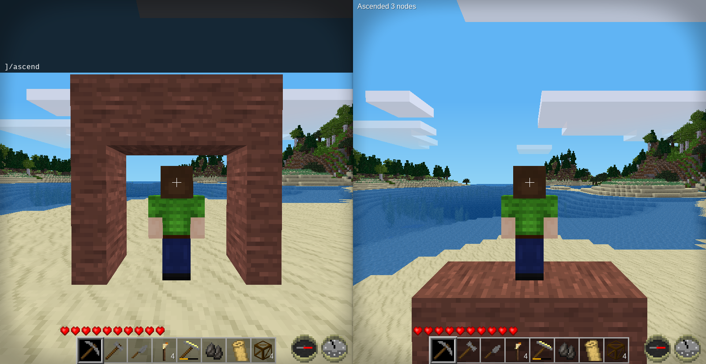

Ascend [ascend]
======================
Ascend by chat command, if possible.

By David G (kestral246@gmail.com)

**New: Now supports Minetest Game and MineClone2.**

Use the chat command: **/ascend** to instantly ascend vertically through rocks and other solid nodes.

Useful for quickly getting out of caves, but be careful you don't get stuck in a very high spot. There's no way to preview the destination ahead of time, so make sure you're prepared.

- Maximum ceiling height defaults to 30 nodes, but can be configured from 10 to 100 nodes.
- Maximum thickness of ceiling that can be traversed defaults to 90 nodes, but can be configured from 10 to 300 nodes.
- *Can't* ascend if not enough room to stand at destination.
- *Can't* ascend while in water or lava.
- However, one *can* ascend to the surface of water, if there's an air node above.
- *Can* ascend through lava, *but not* to the lava's surface.
- Though *can't* ascend through fire.
- *Can't* ascend through doors, walls, or fences.
- *Can't* ascend through oddly-shaped nodes like bed, anvil, flower pot, lantern, etc.
- Optionally can ascend through trees, bushes, and other large vegetation. However, this is **disabled** by default.
- If the scan up reaches unloaded nodes, it will attempt to load them. It's then necessary to reissue the /ascend command, which *may* or *may not* complete.
- Requires "ascend" privilege to use. (Granted automatically in singleplayer. In multiplayer use: */grant &lt;player&gt; ascend.*)

Configuration
-------------

- ascend_ceiling_height: default = 30, but ranges from 10 to 100 nodes.
- ascend_ceiling_thickness: default = 90, but ranges from 10 to 300 nodes.
- ascend_thru_trees: default = false.

Dependencies
------------

*(Only tested on Minetest Game and MineClone2.)*

- Optionally depends on **default**.
- Optionally depends on **mcl_core**.

Licenses
--------

Source code

> The MIT License (MIT)
